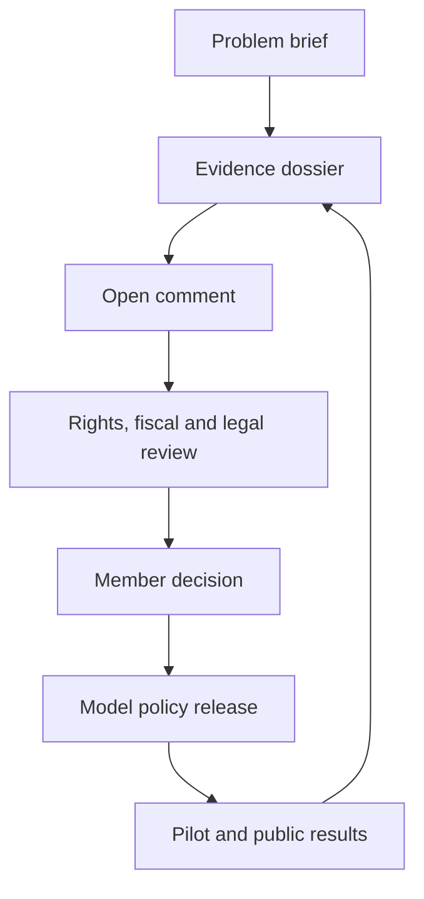

# 4PILLARS Policy Commons

**Engineer. Expose. Organize. Implement.**

An open-source policy reform commons for developing evidence-backed model policies, public-interest tools, and transparent civic campaigns. This repository is the public record for the initial 4PILLARS policy work and a starter framework for a member-governed policy DAO.

> Status: founding draft. Nothing in this repository is legal advice, tax advice, a solicitation, or an instruction to coordinate political spending. The project should obtain jurisdiction-specific counsel before operating a PAC, ballot-measure committee, charity, lobbying program, token program, or investment product.

## What is here

| Area | Purpose |
| --- | --- |
| [Policy library](policies/README.md) | Versioned, reviewable model-policy modules |
| [Governance](governance/DAO-CONSTITUTION.md) | A non-token-first constitutional blueprint for member decision-making |
| [Integrity](integrity/README.md) | Evidence standards and conflict-of-interest controls |
| [Founder volunteer & compensation policy](governance/FOUNDER-VOLUNTEER-AND-COMPENSATION.md) | Unpaid founding service, expense boundaries, and independent approval before future pay |
| [Operations](operations/POLICY-LIFECYCLE.md) | How an idea becomes a reviewed public proposal |
| [Public wiki](wiki/Home.md) | Plain-language guide for the public and new contributors |
| [Outreach pack](outreach/README.md) | Crowdfunding and responsible smart-contract materials |
| [Website](site/index.html) | A dependency-free public starter site |
| [Ecosystem directory](ecosystem/REPOSITORIES.md) | Dedicated pillar repositories, contributor entry points, and cross-repo routing |

## Initial policy workstreams

1. **Housing capital reform** — study homeowner liquidity and small-investor access without treating homes as speculative casinos.
2. **Automation revenue architecture** — evaluate durable, lawful ways to align public revenue with productivity and infrastructure impacts.
3. **Retirement resilience** — analyze Social Security financing options and transition protections.
4. **Public integrity standard** — advance disclosure, recusal, trading-restriction, and independent-enforcement models.

The first four workstreams are deliberately framed as research and model-policy questions. A policy is not deemed adopted merely because it is popular; it must pass the evidence, rights, feasibility, and implementation reviews described in the [policy lifecycle](operations/POLICY-LIFECYCLE.md).

## Dedicated pillar repositories

| Repository | Focus |
| --- | --- |
| [Housing Capital](https://github.com/FOURPILLARSFOUNDATION/4pillars-housing-capital) | Homeowner liquidity, affordability, community wealth, and safeguards against extraction. |
| [Automation & Public Revenue](https://github.com/FOURPILLARSFOUNDATION/4pillars-automation-public-revenue) | Public-capacity and resilience models connected to automation-driven productivity. |
| [Retirement Resilience](https://github.com/FOURPILLARSFOUNDATION/4pillars-retirement-resilience) | Retirement income, transition protections, and long-run benefit resilience. |
| [Public Integrity](https://github.com/FOURPILLARSFOUNDATION/4pillars-public-integrity) | Disclosure, recusal, due process, and independent ethics enforcement. |
| [Civic Pledge Platform](https://github.com/FOURPILLARSFOUNDATION/4pillars-civic-pledge-platform) | A research-only, compliance-first specification for conditioned civic-fundraising workflows; it does not move money. |

Read the [repository directory and contributor instructions](ecosystem/REPOSITORIES.md), including a [worked cross-repository workflow](ecosystem/CROSS-REPO-WORKFLOW.md) for proposals that touch more than one pillar.

## Quick start

No build step is required for the starter site.

```bash
cd site
python3 -m http.server 8080
```

Open `http://localhost:8080`. The site uses plain HTML, CSS, and JavaScript so a community can deploy it to GitHub Pages or any static host without a vendor dependency.

## How a proposal moves



## Contribution path

1. Read [CONTRIBUTING.md](CONTRIBUTING.md) and the [Code of Conduct](CODE_OF_CONDUCT.md).
2. Start an issue using one of the templates in `.github/ISSUE_TEMPLATE/`.
3. Submit a focused pull request with sources, assumptions, affected populations, and a testable implementation plan.
4. Do not add personal data, doxxing material, unverified allegations, or campaign coordination instructions.

## Licensing

- Code and technical tooling: [MIT License](LICENSE)
- Policy text and research (unless a source says otherwise): [CC BY 4.0](LICENSES/CC-BY-4.0.txt)

See [NOTICE](NOTICE) for the project’s source and attribution conventions.
